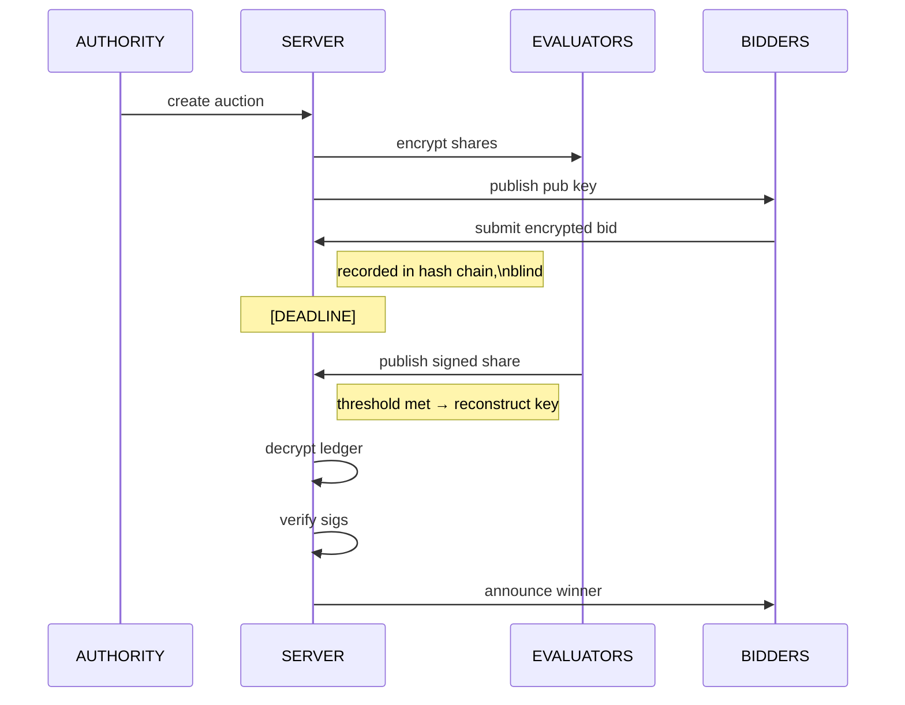

# CSePS — Cryptographically Secure Government e-Procurement System

A prototype procurement system that uses **ECC cryptography, digital signatures, Shamir Secret Sharing, and hash chaining** to guarantee bid integrity, bidder anonymity until deadline, non-repudiation, and verifiable fairness — solving real-world issues of early bid leaks, bid tampering, corruption, and denial disputes.

## Overview

CSePS simulates a government procurement tender where multiple vendors (bidders) submit sealed bids that **nobody — not even the server or evaluators — can read before the deadline**. After the deadline, evaluators collaborate to unlock the bids using a threshold key reconstruction scheme, and the server publishes a fully verifiable decrypted ledger.



## Security Properties

| Property | Mechanism |
|---|---|
| **Bid confidentiality** | Bids encrypted with ECIES (ECDH + AES-GCM); only reconstructed private key can decrypt |
| **Bidder anonymity** | Server records ciphertexts blindly; bid amounts invisible until deadline |
| **Non-repudiation** | Each bid carries an ECDSA signature over the encrypted envelope + metadata |
| **Tamper-evident ledger** | SHA-256 hash chain — any modification breaks all subsequent hashes |
| **Threshold decryption** | Shamir Secret Sharing — private key reconstructed only if ≥ k evaluators cooperate |
| **Replay attack prevention** | Each bid includes a random 128-bit nonce; duplicates flagged at decryption |
| **Premature decryption prevention** | Server rejects share submissions before deadline |
| **Evaluator authentication** | Share submissions are ECDSA-signed by the evaluator; server verifies before recording |
| **Abuse prevention** | Payload size limits, bid capacity limits, auction ID uniqueness |

---

### Component Responsibilities

**`Authority`** — The government procurement office. Creates auctions, specifies evaluators and threshold, initiates the process. Has no special cryptographic power after setup.

**`Server`** — Passive and blind during bidding. Records every encrypted bid into a hash chain without being able to read it. After the deadline, collects evaluator shares, reconstructs the private key, decrypts the ledger, verifies all bids, and announces results.

**`Evaluators`** — Each holds one encrypted Shamir share of the auction private key. They cannot decrypt bids individually. Only after the deadline do they publish their shares. Any `k` of `n` evaluators are sufficient.

**`Bidders`** — Generate their own ECC keypair for identity. Encrypt their bid amount with the auction public key, sign the payload, and submit to the server.

**`LedgerDB`** — Storage abstraction over a JSONL file. Keeps only the last entry in memory (for hash chaining). Everything else lives on disk, making it suitable for large auctions.

---

## Cryptographic Design

### Key Generation & Distribution

```
Server generates:
  (auction_priv, auction_pub)  ←  ECC SECP256R1

secret_int = auction_priv as integer

Shamir split:
  secret_int  →  [(x₁,y₁), (x₂,y₂), ..., (xₙ,yₙ)]
  over a 521-bit prime field

For each evaluator i:
  share_bytes = JSON({ x: xᵢ, y: hex(yᵢ) })
  encrypted_shareᵢ = ECIES_encrypt(evaluator_i.pub_key, share_bytes)

Server publishes:  auction_pub
Server sends:      encrypted_shareᵢ  →  evaluator_i
```

### Bid Encryption & Signing

```
Bidder prepares:
  bid_data      = { "amount": 120000, ... }
  encrypted_bid = ECIES_encrypt(auction_pub, JSON(bid_data))
  nonce         = random 128-bit hex
  timestamp_ms  = current time as integer milliseconds

canonical_bytes = JSON({
  auction_id,  bidder_id,
  encrypted_bid: { ephemeral_pub, nonce, ciphertext },   ← signs the envelope
  nonce,  timestamp_ms
}, sorted_keys=True)

signature = ECDSA_sign(bidder_priv, canonical_bytes)
```

> **Why sign the ciphertext envelope (not the plaintext)?**  
> Signing the encrypted envelope prevents ciphertext substitution attacks — an adversary cannot swap the ciphertext for a different one without invalidating the signature, even though the server cannot read the plaintext.

### Hash Chain

```
entry_hash = SHA256( prev_hash_hex + SHA256(entry_bytes_hex) )

Genesis:  prev_hash = "000...000" (64 zeros)
Entry 0:  hash = SHA256("000...000" + SHA256(entry_0_bytes))
Entry 1:  hash = SHA256(hash_0      + SHA256(entry_1_bytes))
...
```

Any modification to any entry invalidates all subsequent hashes, making tampering immediately detectable by anyone with the public ledger.

### Threshold Reconstruction

```
After deadline, server collects k shares: [(x₁,y₁), ..., (xₖ,yₖ)]

Lagrange interpolation over the 521-bit prime field:
  secret_int = Σᵢ yᵢ · ∏ⱼ≠ᵢ (−xⱼ / (xᵢ − xⱼ))  mod p

auction_priv = ECC_private_key_from_integer(secret_int)
```

### ECIES (Hybrid Encryption)

```
Sender:
  (eph_priv, eph_pub) ← generate_keypair()
  shared = ECDH(eph_priv, recipient_pub)
  sym_key = HKDF(shared, info="cseps-ecies", len=32)
  ciphertext = AES-256-GCM(sym_key, plaintext)
  output: { ephemeral_pub, nonce, ciphertext }

Receiver:
  shared = ECDH(recipient_priv, eph_pub)
  sym_key = HKDF(shared, ...)
  plaintext = AES-256-GCM-decrypt(sym_key, ciphertext)
```

---

## Project Structure

```
cseps/
├── __init__.py
├── crypto.py          # ECC, ECIES, ECDSA, Shamir SSS, hash chain
├── models.py          # Pydantic request/response models
├── database.py        # JSONL ledger abstraction (LedgerDB)
├── server.py          # FastAPI server — all endpoints
├── evaluator.py       # Evaluator simulation class
├── bidder.py          # Bidder simulation class
└── authority.py       # Authority orchestrator class

tests/
├── __init__.py
├── test_crypto.py     # Unit tests: ECC, ECIES, ECDSA, Shamir, hash chain
├── test_database.py   # Unit tests: LedgerDB persistence and iteration
├── test_server.py     # Integration tests: all API endpoints
├── test_evaluator.py  # Unit tests: share receive/publish/sign
└── test_bidder.py     # Unit tests: bid preparation, encryption, signing

scenarios.py                      # End-to-end scenario runner (5 scenarios)
main.py                           # Entry point (server / scenarios / tests)
cseps_data/                       # Auto-created; holds JSONL ledger files
```

---

## Installation

**Requirements:** Python 3.11+

```bash
# Clone or extract the project
cd cseps_project

# Install dependencies
pip install fastapi uvicorn cryptography pydantic httpx pytest pytest-asyncio

# Bootstrap project files (if starting from the single bootstrap script)
python bootstrap.py
```

---

## Running the Project

### Start the API Server

```bash
python main.py server
# Server running at http://localhost:8000
# Interactive docs at http://localhost:8000/docs
```

### Run Scenario Demo (recommended first run)

```bash
python main.py scenarios
```

Runs 5 end-to-end scenarios entirely in-process. No server needed separately.

### Run Unit Tests

```bash
python main.py tests

# Or directly with pytest for verbose output
pytest tests/ -v
```

---

## API Reference

All endpoints are relative to `http://localhost:8000`. Interactive Swagger docs available at `/docs`.

### `POST /auction/create`

Creates a new auction. Called by the Authority.

**Request body:**
```json
{
  "auction_id":  "TENDER_2025_001",
  "title":       "Road Construction Contract",
  "deadline":    1750000000.0,
  "threshold":   2,
  "evaluators": [
    { "evaluator_id": "eval_0", "public_key_pem": "-----BEGIN PUBLIC KEY-----\n..." },
    { "evaluator_id": "eval_1", "public_key_pem": "-----BEGIN PUBLIC KEY-----\n..." },
    { "evaluator_id": "eval_2", "public_key_pem": "-----BEGIN PUBLIC KEY-----\n..." }
  ]
}
```

**Response `200`:**
```json
{
  "status": "created",
  "auction_id": "TENDER_2025_001",
  "public_key_pem": "-----BEGIN PUBLIC KEY-----\n...",
  "encrypted_shares": [
    { "evaluator_id": "eval_0", "encrypted_payload": { "ephemeral_pub": "...", "nonce": "...", "ciphertext": "..." } }
  ]
}
```

---

### `GET /auction/{auction_id}`

Returns public auction metadata. Anyone can call this.

**Response `200`:**
```json
{
  "auction_id": "TENDER_2025_001",
  "title": "Road Construction Contract",
  "deadline": 1750000000.0,
  "threshold": 2,
  "n_evaluators": 3,
  "public_key_pem": "-----BEGIN PUBLIC KEY-----\n...",
  "bid_count": 5,
  "open": true
}
```

---

### `GET /auction/{auction_id}/ledger`

Returns the full public encrypted ledger as JSONL (one JSON object per line).

**Response `200` (plain text JSONL):**
```
{"seq":0,"auction_id":"...","bidder_id":"TechCorp","encrypted_bid":{...},"prev_hash":"000...","hash":"abc..."}
{"seq":1,"auction_id":"...","bidder_id":"BuildSys","encrypted_bid":{...},"prev_hash":"abc...","hash":"def..."}
```

---

### `POST /auction/{auction_id}/bid`

Submit an encrypted, signed bid. Must be called before the deadline.

**Request body:**
```json
{
  "auction_id":           "TENDER_2025_001",
  "bidder_id":            "TechCorp_Ltd",
  "encrypted_bid":        { "ephemeral_pub": "...", "nonce": "...", "ciphertext": "..." },
  "signature":            "3045...",
  "bidder_public_key_pem":"-----BEGIN PUBLIC KEY-----\n...",
  "timestamp":            1749999000.0,
  "timestamp_ms":         1749999000000,
  "nonce":                "a3f8c12d..."
}
```

**Response `200`:**
```json
{ "status": "recorded", "seq": 0, "hash": "7959690038a4245c..." }
```

**Error responses:**
| Code | Reason |
|------|--------|
| `403` | Deadline has passed |
| `413` | Encrypted bid exceeds 4096 bytes or total body exceeds 8192 bytes |
| `429` | Auction bid capacity (10,000) reached |
| `400` | Auction ID mismatch |

---

### `POST /auction/{auction_id}/share`

Evaluator submits their Shamir share after the deadline.

**Request body:**
```json
{
  "auction_id":    "TENDER_2025_001",
  "evaluator_id":  "eval_0",
  "share_x":       1,
  "share_y":       "0x1a2b3c...",
  "signature":     "3046..."
}
```

**Response `200`:**
```json
{ "status": "share_recorded", "collected": 1, "threshold": 2 }
```

**Error responses:**
| Code | Reason |
|------|--------|
| `403` | Auction still open (before deadline) |
| `403` | Unknown evaluator ID |
| `400` | Invalid evaluator signature |

---

### `POST /auction/{auction_id}/decrypt`

Triggers private key reconstruction and full ledger decryption. Requires ≥ threshold shares.

**Response `200`:**
```json
{
  "auction_id": "TENDER_2025_001",
  "chain_valid": true,
  "chain_reason": "ok",
  "winner": "BuildSys_Inc",
  "winning_amount": 120000.0,
  "bids": [
    {
      "seq": 0,
      "bidder_id": "TechCorp_Ltd",
      "bid_data": { "amount": 150000 },
      "valid": true,
      "invalid_reason": null,
      "signature_verified": true,
      "timestamp": 1749999001.0
    }
  ]
}
```

**Error responses:**
| Code | Reason |
|------|--------|
| `403` | Before deadline |
| `400` | Insufficient shares collected |

---

### `GET /auction/{auction_id}/results`

Fetch the cached decrypted ledger (available after `/decrypt` has been called).

**Response `200`:** Same schema as `/decrypt`.  
**Response `404`:** Decryption not yet triggered.

---

## Testing

### Unit Tests

```bash
pytest tests/ -v
```

| Test File | Coverage |
|-----------|----------|
| `test_crypto.py` | ECC key generation, ECIES encrypt/decrypt, tamper detection, ECDSA sign/verify, Shamir split/reconstruct with various thresholds, hash chain integrity |
| `test_database.py` | Append, count, last entry, full iteration, persistence across re-open, clear |
| `test_server.py` | Auction creation, duplicate rejection, bid submission, size limits, deadline enforcement, full decryption flow, insufficient shares |
| `test_evaluator.py` | Share receive/decrypt, publish signature validity, error on missing share |
| `test_bidder.py` | Bid structure, ciphertext decryptability, signature verifiability, nonce uniqueness |

### Scenario Tests

```bash
python main.py scenarios
```

| Scenario | What it tests |
|----------|---------------|
| **Happy Path** | Full flow with 3 bidders, 2-of-3 threshold, correct winner selection |
| **Malicious Oversized Payload** | Server rejects ciphertext > 4096 bytes with `413` |
| **Late Bid** | Server rejects bid after deadline with `403` |
| **Insufficient Threshold** | Decryption blocked at 2/3 shares; succeeds after 3rd share added |
| **Invalid Bid Data** | Zero-amount bid marked invalid; excluded from winner selection |

---

## Limitations & Future Work

| Limitation | Production solution |
|------------|---------------------|
| Server holds auction private key in memory (for demo) | Use a proper HSM or eliminate server-side key storage entirely via MPC |
| No TLS | Deploy behind HTTPS reverse proxy (nginx / Caddy) |
| No bidder authentication at submission time | Add PKI-backed identity certificates |
| Nonce uniqueness checked at decrypt only | Maintain a nonce bloom filter or index during submission |
| Single server process (no clustering) | Use a distributed ledger or a replicated database backend |
| JSONL not indexed | Replace with an append-only database (e.g. PostgreSQL with immutable audit log) |
| Evaluator key distribution is manual | Integrate with a key management service |
| No rate limiting per bidder IP | Add middleware rate limiting (e.g. `slowapi`) |

---

## Dependencies

| Package | Purpose |
|---------|---------|
| `fastapi` | REST API framework |
| `uvicorn` | ASGI server |
| `cryptography` | ECC, ECDH, ECDSA, AES-GCM, HKDF |
| `pydantic` | Request/response model validation |
| `httpx` | Async HTTP client (used in tests) |
| `pytest` | Test runner |
| `pytest-asyncio` | Async test support |
